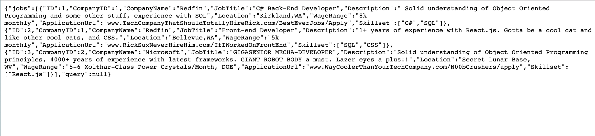

# GitHired-API
C# API web Application that works as a melting pot for job searching and skills needed for those jobs

## GitHired Team Members: Richard Flinn Mike Filicetti, Xia Liu, Julie Ly, Sean Miller

### Group Kanban: https://waffle.io/githired-team/GitHired-API

## Database Schema

- Table Company: This table will contain the information for a company who is posting a job offer.
- Table Jobs: This table will contain the information for the job listings
- Table Required Skills: This table will list the skill key words from a job listing

## Wire Frames
None for API because it is back end (there will be images for use later)

#API Description:
GitHired api has three enpoints: GetCompanyInfo, Getjobs and Skills.

For instance:
Here is the api url for getjobs, when user hit search request from front end, call the api and will return a trunck of data based on user request keywods.
Getjobs api Url(Deployed on Azure): https://githiredapi.azurewebsites.net/api/GetJobs

Data sample:

## User Cases

## Software Requirements

